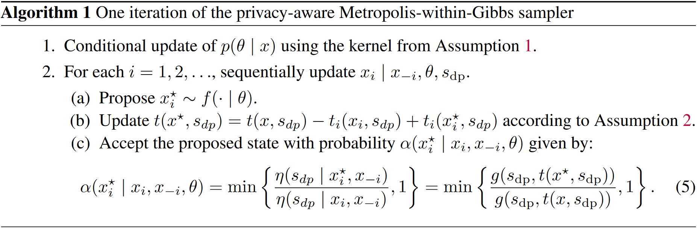

```{r setup, include=FALSE}
knitr::opts_chunk$set(echo = FALSE, warning = FALSE, message = FALSE)
library(ggplot2)
library(kableExtra)
library(tidyverse)
library(knitr)
```


# Introduction
Differential privacy provides a rigorous framework for protecting 
confidential information. One of it's goal is to allow the widespread dissemination
of summary statistics while hiding sensitive characteristics of the data. 
For example, a data aggregation service might 
collect salary information for the purpose of helping its users negotiate salaries.
Such information is typically considered both sensitive. In this scenario, there is a strong desire
to simultaneously keep the salary information of individuals anonymous and make
public, aggregate salary data so others can negotiate better salaries.

In the context of statistical models, 
the bulk of DP research has concentrated on protecting privacy by
either adding noise to a model parameter estimate or adding noise to the 
estimating process itself. Adding noise directly to the data is a less
studied approach and is the case which this paper addresses. 

Statistical regression models typically assume no measurement error in the observed data. In the presence
of such errors, standard estimators can exhibit significant bias. Historically,
mis-measured observations were often associated with data collected issues. 
However, In the context of privacy, confidential data is purposely
infused with noise in order to preserve anonymity.

One approach, to account for the added noise, is to treat the confidential data
as latent quantities within a statistical model. In such settings, it is common
to conduct inference by specifying a complete likelihood. Once the complete likelihood
has been specified, parameter estimation can be done using the EM algorithm or
its Bayesian analogue, the data augmentation method. In the case of dapper,
inference is done using data augmentation as described in [Ju et al.]. A notable benefit of the Bayesian
approach is that both uncertainty quantification and estimation are done 
simultaneously. The EM approach only provides an estimate.

The rest of this article is organized as follows. Section 2 covers the necessary background to understand the mathematical notation
and ideas used throughout the paper. Section 3 goes over the main algorithm without
going into mathematical detail, for specifics see [Ju et al.]. Section 4 provides
an overview of the dapper package and discusses important implementation details.
Section 5 contains two example of how one might use the package to analyze the 
impact of adding noise for privacy.

# Background

Let $x = (x_1, \ldots, x_n) \in \mathcal{X}^n$ represent a confidential 
database containing $n$ records. Usually the goal of collecting data 
is to learn some characteristic about the underlying population. 
To accomplish this task, a common approach is to assume the population
is represented by some statistical model $f( \cdot \mid \theta)$. It is often the case that
some function of $\theta$ has relevant meaning to the scientific question at hand. In this setting,
learning characteristics of a population reduces to learning about $\theta$. 

In the Bayesian framework, this is accomplished by drawing samples from the 
posterior $p(\theta \mid x) \propto f(x \mid \theta) p(\theta)$. For 
large data sets, it is common to work with a summary statistic $s = s(x)$
that has much smaller dimension than the original data. Doing so can
greatly simplify calculations. In general, there can be information
loss with using summary statistics, but for models with a sufficient 
statistic, there is no loss. In the context of privacy, providing
a summary statistic can offer a level of anonymity.


## Differential Privacy
While a summary statistic can already anonymize the data, it is still 
possible to deduce information about an individual entry depending on
the distribution of $x$. For additional anonymity, one idea is to 
add noise to the summary statistic $s$. More formally we write 
$s_{dp} \sim \eta(\cdot \mid x)$. Here, $s_{dp}$ is the noise infused version of $s$ and
$\eta$ is a known noise infusion process. The privacy mechansim
$\eta$ is said to be $\epsilon$-differentially private [Dwork] if for all values of
$s_{dp}$, and all "neighboring" databases $(x,x') \in \mathcal{X}^n \times \mathcal{X}^n$ differing
by one record (denoated by $d(x,x')$), the probability ratio is bounded:
\[
\dfrac{\eta(s_{dp} \mid x)}{\eta(s_{dp} \mid x')} \leq \exp(\epsilon), \quad \epsilon > 0.
\]
The parameter $\epsilon$ is called the privacy loss budget, and controls how informative $s_{dp}$
is about $x$. Larger values of $\epsilon$ correspond to less noise being added.

## Data Augmentation
When sampling from a density $f_{A}$ is difficult, the data augmentation method
instead considers sampling from a joint distribution $f(a,b)$. The joint
distribution should be chosen so that (i) the marginal distribution
with respects to $a$ is $f_{A}$ and (ii) $f(a \mid b)$ and $f(b \mid a)$
are easy to sample from. The choice $f$ is not unique and can require
some foresight.

# Methodology
Given data $s_{dp}$, the goal of Bayesian inference is to sample from the 
posterior distribution $p(\theta \mid s_{dp})$. Since the observed likelihood,
$p(s_{dp} \mid \theta)$ often has no simple closed form expression, most standard
sampling schemes do not apply. To conduct privacy aware Bayesian inference, the dapper package implements
the data augmentation algorithm which allows us to sample from $p(\theta \mid s_{dp})$
without needing to specify $p(s_{dp} \mid \theta)$.

The algorithm considers the joint distribution $p(\theta, x \mid s_{dp})$ and
loops through the two steps:

+ Step 1: $p(\theta \mid x, s_{dp})$
+ Step 2: $p(x \mid \theta, s_{dp})$

Step 1 consist of drawing from the posterior distribution given confidential 
data $x$. Step 2 consist drawing from $p$

\[
p(\theta, x \mid s_{dp}) \propto p(\theta)f(x \mid \theta) \eta(s_{dp} \mid x).
\]

The problem now is to figure out how to sample for this joint posterior. This is
accomplished using a Metropolis-within-Gibbs sampler. Each


{width=80%}


# Using \CRANpkg{dapper}

The package is structured around the two functions `gdp_sample` and
`new_privacy`. The first function is used to draw samples from the 
posterior. The second function is used to create the privacy model. Since the 
input to these functions are R functions, there is a great deal of freedom
left up to user. The next two sections describe in detail the inputs into
these functions and highlight some considerations that should be taken
into account in order avoid slow or unexpected behavior.

(not yet sure where to put this tid bit, here looks about right)
Before delving into  the specifics of each component, it is necessary to clearly
define how the confidential data is represented. Internally, the 
confidential database is encoded as a 2D matrix. There are often multiple ways
of doing this. For example, if our data consist 
of 100 responses from a two question, yes/no, survey. Then we can either encode
the data as a $2 \times 2$ matrix, or a $100 \times 2$ matrix. Both are mathematically
equivalent, but the $2 \times 2$ matrix will be much more memory efficient.
In general, the representation that uses the least amount of memory should be
used. Correctly specifying the privacy model will require a consistent 
representation among all components.

## Sampling

The main function in \pkg{gdpR} is the `gdp_sample` function. The call
signature of the function is:

```{r, echo = TRUE, eval = FALSE}
gdp_sample(data_model, sdp, nobs, init_par, niter = 2000, warmup = floor(niter / 2),
           chains = 1, varnames = NULL)
```

The three required inputs into `gdp_sample` function are the privacy model (`data_model`), the value
of the  observed privatized statistic (`sdp`), and the total number of observations 
in the complete data (`nobs`) [MAKE SURE NOTATION IS INTRODUCED]. The \CRANpkg{gdpR}
package is best suited for problems where the complete data can be represented in
tabular form. This is because internally, it is represented as a matrix.

The optional arguments are the number of mcmc draws (`niter`), the 
burn in period (`warmup`), number of chains (`chains`) and character
vector that names the parameters. Running multiple chains can be done in parallel
using the \CRANpkg{furrr} package. Additionally, progress can be monitored
using the \CRANpkg{progressr} package.


The `data_model` input is a `privacy`
object that can be constructed using the `new_privacy` constructor. The
process of constructing a `privacy` object will be discussed in the next section.

## Privacy Model

Creating a privacy model is done using the `new_privacy` constructor. The 
main arguments consist of the four components as outlined in the methodology
section.

```{r, echo=TRUE, eval=FALSE}
new_privacy(post_smpl = NULL, lik_smpl = NULL, ll_priv_mech = NULL,
            st_calc = NULL, add = FALSE, npar = NULL)
```

The internal implementation of the DA algorithm in `gdp_sample` requires
some care in how each component is constructed. 

* `lik_smpl` is an R function that samples from the likelihood. Its
call signature should be `lik_smpl(theta)` where `theta` is a vector
representing the likelihood model parameters being estimated. This function
must work with the supplied initial parameter provide in the `init_par`
argument of `gdp_sample` and its output should be a $n \times k$ matrix. $k$ the
dimension of the complete data table.


* `post_smpl` is a function which represents the posterior sampler. It should
have the call signature `post_smpl(dmat, theta)`. Where `dmat` is the 
complete data. This sampler can be generated by wrapping mcmc samplers generated from other R packages 
(e.g. \CRANpkg{rstan}, \CRANpkg{fmcmc}, \CRANpkg{adaptMCMC}).
If using this approach, it is recommended to avoid using packages such as \CRANpkg{mcmc}
whose implementation clashes with `gdp_sample`. In the case of \CRANpkg{mcmc},
the Metropolis-Hastings loop is implemented in C which incurs a very large overhead
in `gdp_sample` since it is reinitialized every iteration. In general, repeatedly calling
an R function that hooks into C code is slow. (NOT QUITE ACCURATE FIX LATER)

* `ll_priv_mech` is an R function that represents the log-likelihood of 
$\eta(s_{sdp} \mid x)$. The function can output the log likelihood 
up to an additive constant.

* `st_calc` is an R function which calculates the summary statistic. The optional
argument `add` is a flag which represents whether $T$ is additive or not.


# Examples

## 2x2 Contingency Table
A common procedure when analyzing contingency tables is to estimate the 
odds ratio. Something something about safetab to connect back to DP (dont forget citation!). 
As a demonstration, we analyze the UC Berkeley admissions data, which is often
used as an illustrative example of Simpson's paradox. The question is whether
the data suggest there is bias against females during the college admissions 
process. Below is a table of the aggregate admissions result from six departments based on sex.


```{r, echo = FALSE}
set.seed(1)
tmp <- apply(UCBAdmissions, 3, identity, simplify=FALSE)
adm_cnf <- Reduce('+', tmp)
adm_prv <- round(adm_cnf + rnorm(4, mean = 0, sd = 100))
```


```{r, echo = FALSE}
kbl(list(adm_cnf, adm_prv), booktabs = TRUE) %>%
  kable_styling(position = 'center', latex_options = c("hold_position"))
```


```{r, echo = FALSE}
#generate 2x2 table data
x <- c(adm_cnf)
sdp <- c(adm_prv)
```

Below we walk through the process of defining a privacy model.


1. `lik_smpl`: Conditional on the table total, the table counts follow a multinomial
distribution. We can easily draw from this distribution using the
`rmultinom` function in the `base` stats package. Note, in this example,
the return value of one sample from `rmultinom` is a $4 \times 1$ matrix. In order to 
conform with `dapper_sample` we must convert the matrix to a vector.
    ```{r, echo = TRUE}
    lik_smpl <- function(theta) {
      t(rmultinom(1, 4526, theta))
    }
    ```
2. `post_smpl`: Given confidential data $X$ we can derive the posterior analytically
using a Dirichlet prior. In this example, we use a flat prior which
corresponds to Dirch(1) distribution. A sample from the Dirichlet distribution
can be generated using the gamma distribution via the following relation (INSERT)
    ```{r, echo = TRUE}
    post_smpl <- function(dmat, theta) {
      x <- c(dmat)
      t1 <- rgamma(length(theta), x + 1, 1)
      t1/sum(t1)
    }
    ```
3. `st_calc`: The complete data can be represented in two ways. Micro vs cell totals.
(what section to introduce?) This function must return a vector.
    ```{r, echo = TRUE}
    st_calc <- function(dmat) {
      c(dmat)
    }
    ```
4. `ll_priv_mech`: Privacy Mechanism
Guassian white noise is added to each cell total. Hence given
confidential data $(n_{11}, n_{22}, n_{12}, n_{21})$
\[
\eta(s_{dp} \mid x) = \prod \phi(s_{sd}; n_{ij}, 100^2)
\]
    ```{r, echo = TRUE}
    ll_priv_mech <- function(sdp, x) {
      dnorm(sdp - x, mean = 0, sd = 100, log = TRUE)
    }
    ```


<!-- end of list -->

Once privacy model has been defined we can run `gdp_sample`

```{r, echo = TRUE}
library(DPloglin)
dmod <- new_privacy(post_smpl = post_smpl,
                    lik_smpl = lik_smpl,
                    ll_priv_mech = ll_priv_mech,
                    st_calc = st_calc,
                    add = FALSE,
                    npar = 4,
                    varnames = c("pi_11", "pi_21", "pi_12", "pi_22"))
                  
dp_out <- dapper_sample(dmod,
                  sdp = c(adm_prv),
                  niter = 10000,
                  warmup = 1000,
                  chains = 1,
                  init_par = rep(.25,4))
```

results can be quickly summarized using the `summary` function

```{r,echo = FALSE}
summary(dp_out)
```

Diagnostic checks can be done using the \pkg{Bayesplot} package.

```{r, fig.height=3, fig.width=5, fig.align='center'}
plot(dp_out)
```

log odds distribution

```{r, fig.height=3, fig.width=5, fig.align='center'}
tv <- dp_out$chain
or <- as.numeric((tv[,1] * tv[,4]) / (tv[,2] * tv[,3]))
quantile(or, c(.025, .50, .975))

ggplot(tibble(x=or), aes(x)) + geom_histogram() + xlim(-1,10)
```
(Insert gdp Analysis Here)

For clean data, a estimate for the odds ratio and a confidence interval
can be constructed using Woolf's method (i.e. A wald confidence interval).
It uses the fact that the log of the odds ratio is approximately 
normal for large sample sizes.
\[
\log\left(\dfrac{n_{11} \cdot n_{22}}{n_{12} \cdot n_{21}}\right) 
  \pm z_{\alpha/2}\sqrt{\dfrac{1}{n_{11}} + \dfrac{1}{n_{22}} + \dfrac{1}{n_{12}} + \dfrac{1}{n_{21}}}
\]

```{r, echo = TRUE}
or_confint <- function(x, alpha) {
  or <- log(x[1] * x[4]/ (x[2] * x[3]))
  se <- sqrt(sum(1/x))
  c(or - qnorm(alpha/2) * se, or + qnorm(alpha/2) * se)
}

#clean data
exp(or_confint(x, .95))

#privitized data
exp(or_confint(sdp, .95))
```


## Logistic Regression

```{r, eval = FALSE, include= FALSE}


```

# Summary

This package is cool. You should install it.