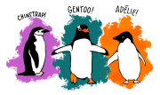

```{r setup, include=FALSE}
knitr::opts_chunk$set(echo = FALSE, warning = FALSE, message = FALSE)
library(plotly)
library(ggplot2)
library(palmerpenguins)
library(kableExtra)
```


# Introduction

The ease and pervasiveness of modern data collection technologies has raised
concerns about data privacy. [@Dwork2013] introduced the differential privacy
framework as a means to rigorously define privacy. The framework has lead to the
development of many ``privitized'' versions of existing statistical methods. The
process of privitizing usually consist of introducing random noise in someway using
a known distribution.

# overview of the gdpR packge

This section reviews This will show a verbatim inline R expression `` `r
1+1` `` in the output.


# Background

Some packages on interactive graphics include \CRANpkg{plotly} [@plotly] that interfaces with Javascript for web-based interactive graphics, \CRANpkg{crosstalk} [@crosstalk] that specializes cross-linking elements across individual graphics.  The recent R Journal paper \CRANpkg{tsibbletalk} [@RJ-2021-050] provides a good example of including interactive graphics into an article for the journal. It has both a set of linked plots, and also an animated gif example, illustrating linking between time series plots and feature summaries.

# Customizing tooltip design with \pkg{ToOoOlTiPs}

\pkg{ToOoOlTiPs} is a packages for customizing tooltips in interactive graphics, it features these possibilities.

# A gallery of tooltips examples

The \CRANpkg{palmerpenguins} data [@palmerpenguins]  features three penguin species which has a lovely illustration by Alison Horst in Figure \@ref(fig:penguins-alison). 

```{r penguins-alison, out.width = "100%", out.height = "30%", fig.cap = "Artwork by \\@allison\\_horst", fig.alt="A picture of three different penguins with their species: Chinstrap, Gentoo, and Adelie. "}

```

Table `r knitr::asis_output(ifelse(knitr::is_html_output(), '\\@ref(tab:penguins-tab-interactive)', '\\@ref(tab:penguins-tab-static)'))` prints at the first few rows of the `penguins` data:

```{r penguins-tab-interactive, eval = knitr::is_html_output(), layout = "l-body-outset"}
knitr::kable(head(penguins), format = "html", caption = "A basic table")
```

```{r penguins-tab-static, eval = knitr::is_latex_output()}
knitr::kable(head(penguins), format = "latex", caption = "A basic table") %>% 
  kableExtra::kable_styling(font_size = 7)
```   

Figure `r knitr::asis_output(ifelse(knitr::is_html_output(), '\\@ref(fig:penguins-plotly)', '\\@ref(fig:penguins-ggplot)'))` shows an `r ifelse(knitr::is_html_output(), 'interactive', '')` plot of the penguins data, made using the `r knitr::asis_output(ifelse(knitr::is_html_output(), '\\CRANpkg{plotly}', '\\CRANpkg{ggplot2}'))` package. 

```{r penguins-plotly, echo = TRUE, fig.height = 5, fig.cap="A basic interactive plot made with the plotly package on palmer penguin data. Three species of penguins are plotted with bill depth on the x-axis and bill length on the y-axis. When hovering on a point, a tooltip will show the exact value of the bill depth and length for that point, along with the species name.", include=knitr::is_html_output(), eval=knitr::is_html_output(), fig.alt = "A scatterplot of bill length against bill depth, both measured in millimetre. The three species are shown in different colours and loosely forms three clusters. Adelie has small bill length and large bill depth, Gentoo has small bill depth but large bill length, and Chinstrap has relatively large bill depth and bill length."}
p <- penguins %>% 
  ggplot(aes(x = bill_depth_mm, y = bill_length_mm, 
             color = species)) + 
  geom_point()
ggplotly(p)
```

```{r penguins-ggplot, echo = TRUE, fig.height = 5, fig.cap="A basic non-interactive plot made with the ggplot2 package on palmer penguin data. Three species of penguins are plotted with bill depth on the x-axis and bill length on the y-axis. Visit the online article to access the interactive version made with the plotly package.", include=knitr::is_latex_output(), eval=knitr::is_latex_output()}
penguins %>% 
  ggplot(aes(x = bill_depth_mm, y = bill_length_mm, 
             color = species)) + 
  geom_point()
```

# Summary

We have displayed various tooltips that are available in the package \pkg{ToOoOlTiPs}. 
